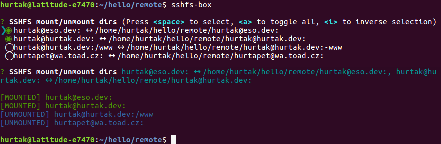
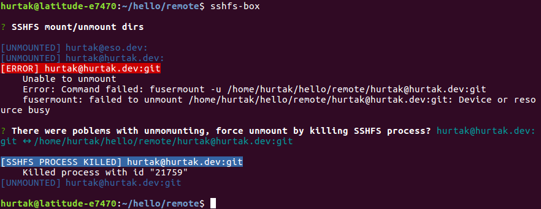

# SSHFS box


CLI tool to manage remote directories with SSHFS.

## Features

- One tool to manage all of your sshfs remote directories.



- Great error messages telling you exactly what went wrong.
- Error recovery, in case there is any broken hanging sshfs proceses, sshfs-box will give you option to kill them.



## Prerequisites

- Dependencies:
    - `node.js` >= 8
    - Commands used under the hood that your operating system needs to support:
        - `sshfs`
        - `fusermount`
        - `mount`
        - `ps`
        - `kill`
    - `npm` to install

- Supported operating systems
    - Ubuntu &ndash; tested, works
    - MacOs &ndash; tested on older versions of sshfs-box, should work

## Install

- `npm install --global sshfs-box`

## Usage

- `sshfs-box`
    - Starts the interface for mounting/unmounting.
    - When run for the first time, it will prompt to create new config.
- `sshfs-box --config` or `sshfs-box -c`
    - Configure remote & local paths to connect.
- `sshfs-box --help`
    - Displays avaliable CLI commands.

### Configuration

- Configuration is displayed when sshfs-box app is run for the first time or when passing the `--config` flag.
- Config is stored in `~/.config/sshfs-box.json`.

#### Config example

```json
{
    urls: [
        "username@host1:",
        "username@host2:/home/user",
        "username@host2:/www"
    ],
    "folder": "/home/username/remote"
},
```

### Config fields

- `urls`
    - `Required` field
    - `Array` of strings of remote locations that sshfs-box will try to with SSHFS.
- `folder`
    - `Required` field
    - `String` of local folder where remote locations will be mounted.
    - If folder does not exist, it will be created automatically.

## Potential improvements

- Mounting/Unmounting of multiple locations are currently done in synchronous way, maybe we could pararelize if performance is a problem.
- Add support for separator - https://github.com/SBoudrias/Inquirer.js/#separator.

## TODO

- run through Grammarly
- test properly
- mention on twitter
