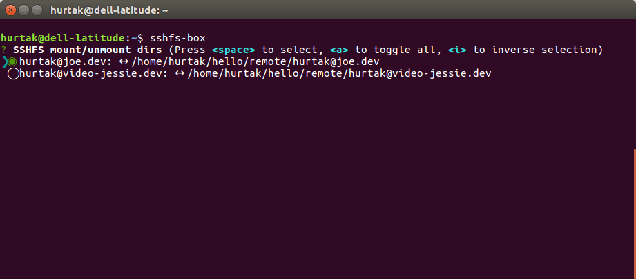

# SSHFS box


CLI tool to manage remote directories with SSHFS.

## Prerequisites

- Dependencies
    - `node.js` >= 8
    - commands used under the hood that your operating system needs to support:
        - `sshfs`
        - `fusermount`
        - `mount`
        - `ps`
        - `kill`
    - `npm` to install

- Supported operating systems
    - Ubuntu - tested, works
    - MacOs - tested on older versions of sshfs-box, should work

## Install

- `npm install --global sshfs-box`

## Usage

- `sshfs-box`
    - starts the interface for mounting/unmounting
    - when run for the first time, it will prompt to create new config
- `sshfs-box --config`
    - configure remote & local paths to connect
    - config is stored in ~/.config/sshfs-box.json

### Configuration

- `urls` array of strings of remote locations where sshfs-box will try to connect
- `folder` string of local folder where remote locations will be mounted (does not need to exist)

```json
{
    "urls": [
        "user@host1:dir",
        "user@host2:dir"
    ],
    "folder": "/home/username/remote"
}
```

## Force unmout

- tries to be ndeestructive, only kills processes created with sshfs box

## Screenshots



## Potential improvements

- Mounting/Unmounting of multiple locations are currently done in synchronous way, maybe we could pararelize if performance is a problem.
- Add support for separator - https://github.com/SBoudrias/Inquirer.js/#separator.

## TODO

- rename?
- update meow
    - https://github.com/sindresorhus/meow/releases/tag/v4.0.0
- docs
- gifs
- test properly
- mention on twitter
