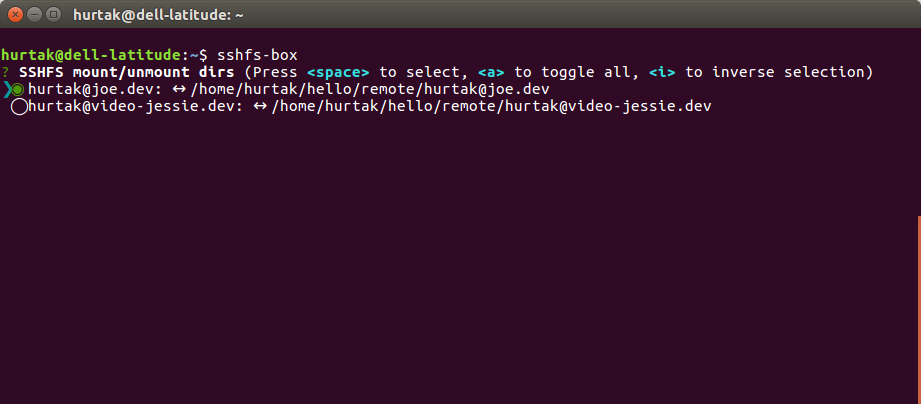

# SSHFS box

- small CLI tool to simply mount/unmount remote sshfs directories

## Prerequisites

- node.js >= 6
- npm
- operating system
    - Linux - tested works
    - MacOs - untested, should work

## Install

- `npm install --global sshfs-box`

## Usage

- `sshfs-box`
    - starts the interface for mounting/unmounting
    - when run for the first time, it will prompt to create new config
- `sshfs-box --config`
    - configure remote & local paths to connect
    - config is stored in ~/.config/sshfs-box.json

### Configuration

- `urls` array of strings of remote locations where sshfs-box will try to connect
- `folder` string of local folder where remote locations will be mounted (does not need to exist)

```json
{
    "urls": [
        "user@host1:dir",
        "user@host2:dir"
    ],
    "folder": "/home/username/remote"
}
```

## Screenshots



## TODO

- cleanup package.json
- gifs
- write proper description and use it in this readme and in package.json
